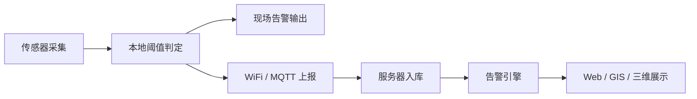
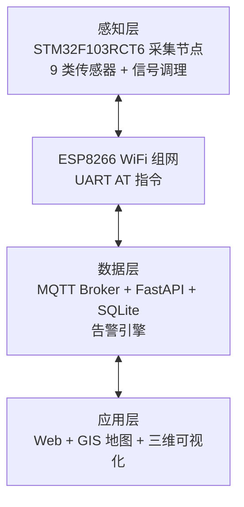

<div align="center">

# 隧道/桥梁结构健康监测系统


</div>

面向隧道与桥梁结构健康监测的嵌入式系统：以 STM32 采集节点 + 9 类传感器 + WiFi/MQTT 组网，实现结构状态的可感知、可预警、可追溯，推动结构管养从“被动应急”向“主动防御”转变。

> [!NOTE]
> 本项目为高校实习/课程团队项目（第六组 · 超说的都队），用于教学展示与求职作品。固件与服务器已完成并端到端测试通过；Qt 桌面端与移动端 App 在实施中裁剪，不在最终交付范围内。

## 目录

- [项目概览](#项目概览)
- [业务目标](#业务目标)
- [范围与边界](#范围与边界)
- [系统架构](#系统架构)
- [核心功能](#核心功能)
- [技术选型](#技术选型)
- [数据与接口约定](#数据与接口约定)
- [项目结构](#项目结构)
- [快速开始](#快速开始)
- [实施计划](#实施计划)
- [质量与验收](#质量与验收)
- [安全要求](#安全要求)
- [协作与版本管理](#协作与版本管理)
- [文档](#文档)
- [许可证](#许可证)

## 项目概览

| 项目属性 | 内容 |
| --- | --- |
| 项目名称 | 隧道/桥梁结构健康监测嵌入式系统 |
| 团队 | 第六组 · 超说的都队（7 人） |
| 计划周期 | 2026-08-25 至 2026-09-30（D1–D30） |
| 现场主控 | STM32F103RCT6（Cortex-M3，72MHz） |
| 传感器 | 9 类：振动、应力、温湿度、水位、渗水、位移、裂缝、车辆荷载 |
| 组网 | WiFi 局域网（ESP8266，AT 指令 / USART）+ MQTT 3.1.1 |
| 服务器 | Python + FastAPI + MQTT（amqtt/paho）+ SQLite |
| 当前状态 | 数据链路贯通，端到端测试通过 |

项目成功标准：9 类传感器实时采集、本地阈值告警、MQTT 数据上报入库、REST API 对外查询、多端可视化展示，以及代码、硬件、文档可复现。

## 业务目标

- **全域可感知**：部署嵌入式采集节点，实时采集振动、应力、温湿度、水位、渗水、位移、裂缝、车辆荷载等关键参数。
- **数据可追溯**：监测数据实时入库，支持历史查询、统计与回放。
- **可视化展示**：Web + GIS 地图、三维可视化多端呈现实时状态。
- **预警可联动**：参数越限自动告警，现场本地告警 + 平台记录闭环。

### 监测闭环



## 范围与边界

### 本期范围

| 工作域 | 建设内容 |
| --- | --- |
| 感知层 | STM32F103RCT6 采集节点 + 9 类传感器 + 信号调理电路 |
| 通信 | ESP8266 WiFi 组网、MQTT 上报、心跳保活与掉线重连 |
| 数据层 | MQTT 转发、SQLite 入库、告警规则引擎、REST API |
| 应用层 | Web 网页 + GIS 地图、三维可视化 |
| 硬件 | 原理图、PCB、焊接调试、采集节点整机装配 |

### 不在本期范围内

- Qt 桌面端与移动端 App（实施中裁剪，资源集中于 Web 与三维可视化）。
- 面向真实工程部署的结构安全认证、公网高可用与长期在线运行。

## 系统架构



### 架构原则

- **感知优先**：传感器稳定输出是上层数据质量的基础，分压、放大、滤波、电平转换在硬件层完成。
- **边缘告警**：本地阈值判定与告警输出不依赖网络，断网时仍可现场告警。
- **统一上报接口**：所有传感器统一抽象为 `device_id + 传感器类型 + 采样值 + 时间戳` 上报，便于逐类接入与扩展。
- **配置与代码分离**：告警阈值可配置、可下发，接口规范先行。

## 核心功能

### 功能基线

- 9 类传感器数据采集（ADC / I2C / GPIO）与传感器抽象层。
- 本地阈值判定与三级告警（预警 / 报警 / 严重），支持回差防抖。
- MQTT 数据上报、心跳保活、掉线重连。
- 服务器数据入库、阈值告警、REST API 查询。
- Web + GIS 地图、三维可视化展示与历史数据回放。

### 硬件与信号调理

- 传感器电路接入与调试：供电匹配、电平转换、信号调理（分压、同相放大、RC 低通滤波）。
- 应变桥式测量：惠斯通电桥 + 仪表运放放大微小差分信号。
- PCB 焊接、上电检查、短路排查与采集节点整机装配。

## 技术选型

| 层次 | 技术 | 说明 |
| --- | --- | --- |
| 主控制器 | STM32F103RCT6 + STM32CubeF1 HAL | 实时采集、边缘告警、通信 |
| 通信模块 | ESP8266（AT 指令，USART） | WiFi 组网，MQTT over TCP |
| 消息协议 | MQTT 3.1.1 | 遥测 / 心跳 / 告警主题 |
| 服务器 | Python + FastAPI + MQTT（amqtt/paho） | 数据接入、REST API |
| 数据库 | SQLite | 设备、传感器、历史数据、告警 |
| 前端 | Vue + Leaflet | Web + GIS 地图 |
| 三维可视化 | Three.js + Blender | 隧道/桥梁场景 + 传感器点位映射 |

## 数据与接口约定

### MQTT 主题

| 主题 | 方向 | 用途 |
| --- | --- | --- |
| `shm/{device_id}/data` | 设备 → 平台 | 周期遥测（9 类传感器 JSON） |
| `shm/{device_id}/heartbeat` | 设备 → 平台 | 心跳保活 |
| `shm/{device_id}/alarm` | 设备 → 平台 | 越限告警事件 |

### 上报字段

每帧遥测包含 `device_id`、传感器类型、采样值、时间戳；数据经 MQTT 主题分发，服务器解析后入库。报文格式以《接口规范 v1.0》为准。

## 项目结构

```text
tunnel-bridge-monitor/
├── firmware/
│   └── stm32f103rct6/        # STM32CubeMX + Keil 台架固件（传感器驱动、MQTT、边缘告警、TFT 显示）
├── backend/                  # Python 服务器（FastAPI + MQTT + SQLite + 模拟器 + 端到端自测）
├── docs/                     # 项目计划书、总体规划、接口规范 v1.0、分工日志
├── .gitignore
├── .gitattributes
└── README.md
```

## 快速开始

### 服务器（无需硬件）

```bash
git clone https://github.com/cancan12138/tunnel-bridge-monitor.git
cd tunnel-bridge-monitor/backend
pip install -r requirements.txt
python broker.py            # 启动纯 Python MQTT Broker（127.0.0.1:1883）
python main.py              # 另开终端，启动 FastAPI + MQTT 订阅
python simulator.py         # 另开终端，模拟监测节点上报
```

浏览器访问 <http://127.0.0.1:8000/api/devices> 等接口。启动、验证与报文细节见 [`backend/README.md`](backend/README.md)。

### STM32 台架固件

用 Keil MDK 打开 `firmware/stm32f103rct6/MDK-ARM/123.uvprojx` 编译烧录；CubeMX 工程为 `firmware/stm32f103rct6/123.ioc`（原 CubeMX 工程名 `123`，与 `firmware/stm32f103rct6` 目录对应）。

## 实施计划

| 里程碑 | 目标日期 | 完成标准 |
| --- | --- | --- |
| 需求分析与总体设计 | D1–D7 | 架构评审通过、接口规范 v1.0 |
| 硬件设计与数据采集 | D8–D14 | PCB 打样、9 类传感器接入、固件采集 |
| 服务器与通信开发 | D8–D21 | 通信链路贯通、数据入库 |
| 平台开发与系统集成 | D15–D21 | 三端实时显示、硬件整机 |
| 部署验证与迭代优化 | D22–D30 | 系统验收、文档收尾 |

## 质量与验收

### 关键指标

- 采集频率：常规 1 次/分钟，告警 1 次/秒。
- 上报延迟：采集到服务器 < 2 秒。
- 接口响应：REST API < 200ms。
- 并发：≥ 10 个采集节点同时在线。
- 数据保留：历史数据 ≥ 30 天。
- 掉线重连：心跳 60s，断网自动重连。

### 测试层级

采集测试 → 告警测试 → 接口测试 → 端到端测试 → 硬件验收测试。

## 安全要求

- 实体样品全部低压供电，信号调理电路与主控电气隔离。
- 传感器按“温湿度 → 振动 → 水位 → 位移 → 应力 → 荷载”优先级逐类接入，接口规范先行。
- Wi-Fi、MQTT 密码与个人信息不得提交到仓库；本地配置使用脱敏示例。

## 协作与版本管理

### 成员分工

| 成员 | 角色 |
| --- | --- |
| 李昌 | 组长 / 架构 / 文档 |
| 姚凯洋 | 硬件（原理图 / PCB） |
| 严鹏远 | 硬件（传感器电路接入 / 焊接调试 / 硬件测试） |
| 杨策凡 | 嵌入式固件 |
| 张永超 | 软件（服务器 / Web / 3D） |
| 王学博 | 测试 |
| 宋柄深 | 运维 |

### 提交规范

提交信息采用 Conventional Commits 风格：

```text
feat(firmware): add sensor abstraction layer
fix(backend): correct alarm threshold compare
docs(interface): update telemetry schema
```

## 文档

| 文档 | 说明 |
| --- | --- |
| [项目计划书](docs/隧道桥梁监测系统_项目计划书.docx) | 需求、技术路线、开发阶段 |
| [项目总体规划](docs/隧道桥梁监测系统_项目总体规划.docx) | 总体架构、任务分解、交付清单 |
| [接口规范 v1.0](docs/隧道桥梁监测系统_接口规范v1.0.docx) | 传感器 ↔ 固件 ↔ 平台接口约定 |
| [分工与任务日志](docs/隧道桥梁监测系统_7人分工与任务日志.docx) | 成员分工与实施日志 |

## 许可证

本仓库为团队项目作品，用于教学与求职展示，当前未提供开源许可证。

---

**最后更新：** 2026-09-30 · **团队：** 第六组 · 超说的都队
